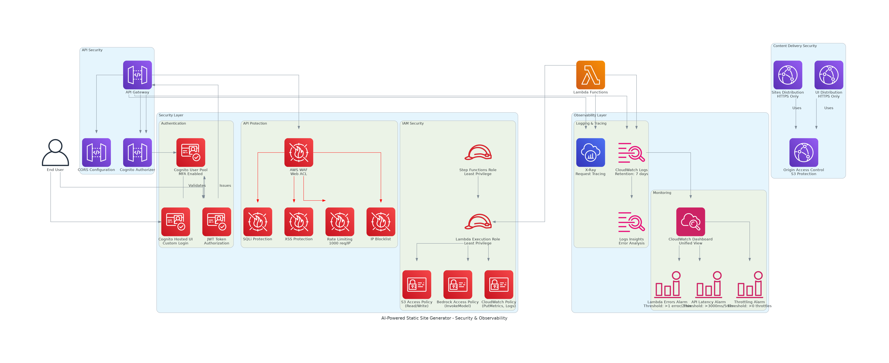
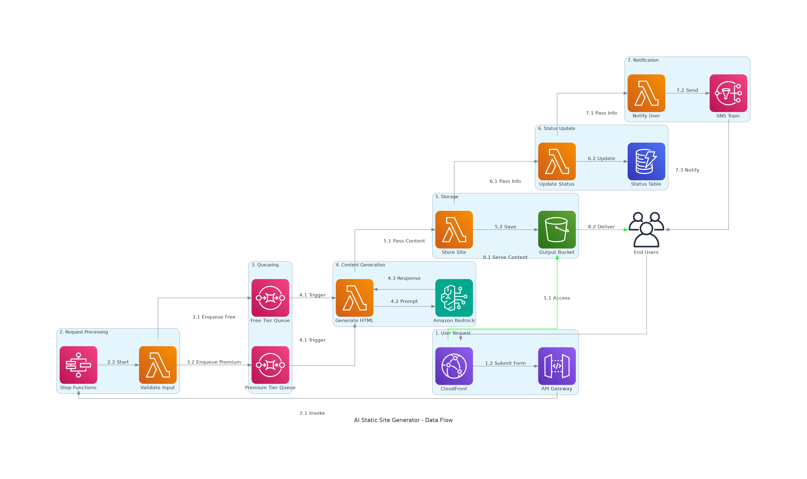
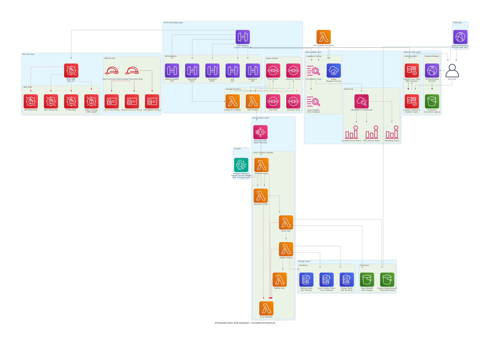
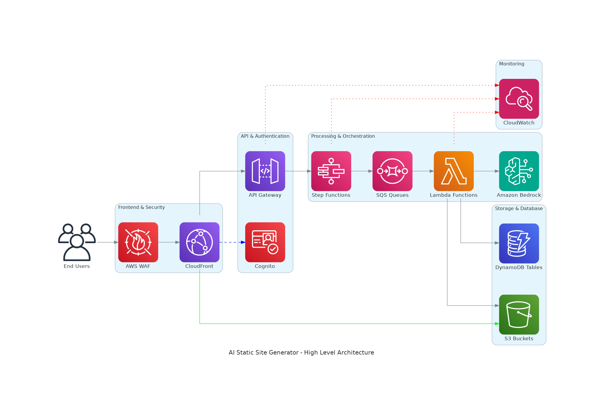

# Arquitetura Detalhada do Gerador de Sites com IA

## 🌐 Visão Geral da Solução

### Objetivo Arquitetural
Sistema serverless de geração de sites utilizando inteligência artificial, projetado com foco em escalabilidade, segurança e eficiência de custos, seguindo as melhores práticas do AWS Well-Architected Framework.

## 📊 Diagramas de Arquitetura

### Segurança e Observabilidade

*Foco na topologia de rede, segurança e controle de acesso*

### Fluxo de Dados e Processamento

*Pipeline de processamento numerado mostrando o fluxo de dados*

### Fluxo Geral

*Fluxo de dados logica da geração de site via prompt*

### High Level

*Fluxo High Level*

## 🏗️ Componentes da Arquitetura

### 📡 Camada de Distribuição e Segurança
| Serviço | Função | Configuração | Benefícios |
|---------|--------|--------------|------------|
| **Amazon CloudFront** | CDN Global | Distribuição mundial, cache inteligente | Baixa latência, redução de custos |
| **AWS WAF** | Firewall de Aplicação Web | Regras personalizadas, proteção DDoS | Segurança proativa contra ataques |

### 🔐 Camada de Identidade e Acesso
| Serviço | Função | Configuração | Benefícios |
|---------|--------|--------------|------------|
| **Amazon Cognito** | Autenticação de Usuários | User pools, federação | Gestão segura de identidades |
| **AWS IAM** | Controle de Acesso | Políticas de menor privilégio | Segurança granular |
| **AWS Secrets Manager** | Gestão de Segredos | Rotação automática, criptografia | Proteção de credenciais |
| **AWS KMS** | Gerenciamento de Chaves | Chaves gerenciadas, rotação | Criptografia robusta |

### 🌐 Camada de Rede
| Serviço | Função | Configuração | Benefícios |
|---------|--------|--------------|------------|
| **Amazon VPC** | Rede Virtual Privada | Multi-AZ, subnets públicas/privadas | Isolamento e controle de rede |
| **NAT Gateway** | Conectividade de Saída | Alta disponibilidade | Acesso seguro à internet |
| **Internet Gateway** | Conectividade de Entrada | Ponto único de entrada | Controle de tráfego |

### 🚀 Camada de Computação
| Serviço | Função | Configuração | Benefícios |
|---------|--------|--------------|------------|
| **AWS Lambda** | Processamento Serverless | Múltiplas funções especializadas | Escalabilidade automática |
| **AWS Step Functions** | Orquestração de Fluxos | Máquina de estados visual | Coordenação de processos |
| **Amazon API Gateway** | Gateway de APIs | REST APIs, throttling | Gestão centralizada de APIs |

### 🤖 Camada de Inteligência Artificial
| Serviço | Função | Configuração | Benefícios |
|---------|--------|--------------|------------|
| **Amazon Bedrock** | Modelos de IA | Foundation models, fine-tuning | IA generativa avançada |

### 📦 Camada de Armazenamento
| Serviço | Função | Configuração | Benefícios |
|---------|--------|--------------|------------|
| **Amazon S3** | Armazenamento de Objetos | Versionamento, criptografia, lifecycle | Durabilidade e escalabilidade |
| **Amazon DynamoDB** | Banco NoSQL | Auto-scaling, TTL, streams | Performance consistente |

### 📨 Camada de Mensageria
| Serviço | Função | Configuração | Benefícios |
|---------|--------|--------------|------------|
| **Amazon SQS** | Filas de Mensagens | Dead letter queues, visibilidade | Desacoplamento de componentes |
| **Amazon SNS** | Notificações | Multi-protocolo, fanout | Comunicação assíncrona |

### 📊 Camada de Monitoramento
| Serviço | Função | Configuração | Benefícios |
|---------|--------|--------------|------------|
| **Amazon CloudWatch** | Logs e Métricas | Dashboards, alarmes | Observabilidade completa |
| **AWS X-Ray** | Rastreamento Distribuído | Service map, traces | Análise de performance end-to-end |
| **AWS CloudTrail** | Auditoria | Logs de API, compliance | Rastreabilidade de ações |

## 🔄 Fluxo de Processamento

### Pipeline de Geração de Sites

1. **Entrada do Usuário**
   - Usuário acessa via CloudFront
   - WAF filtra requisições maliciosas
   - API Gateway recebe a solicitação

2. **Validação e Enfileiramento**
   - Lambda de validação verifica entrada
   - Dados são enfileirados no SQS
   - Step Functions inicia orquestração

3. **Processamento com IA**
   - Lambda de geração acessa Bedrock
   - Secrets Manager fornece credenciais
   - IA gera conteúdo do site

4. **Armazenamento**
   - Site gerado é salvo no S3
   - Metadados são registrados no DynamoDB
   - Versionamento e backup automáticos

5. **Notificação**
   - Lambda de notificação é acionado
   - SNS envia alertas ao usuário
   - CloudWatch registra métricas

## 🔒 Considerações de Segurança

### Princípios Implementados
- **Defesa em Profundidade**: Múltiplas camadas de segurança
- **Menor Privilégio**: IAM roles específicas por função
- **Criptografia**: Dados em repouso e em trânsito
- **Monitoramento**: Logs detalhados e alertas

### Controles de Segurança
- WAF com regras personalizadas
- VPC com subnets isoladas
- Secrets Manager para credenciais
- KMS para criptografia
- CloudTrail para auditoria

## 📈 Escalabilidade e Performance

### Estratégias de Escalabilidade
- **Horizontal**: Lambda escala automaticamente
- **Vertical**: DynamoDB com auto-scaling
- **Global**: CloudFront para distribuição mundial
- **Elástica**: SQS para absorver picos de demanda

### Métricas de Performance
- Latência de API: < 200ms
- Tempo de geração: < 30s
- Disponibilidade: 99.99%
- Throughput: 1000+ req/min

## 💰 Otimização de Custos

### Estratégias Implementadas
- **Serverless**: Pagamento por uso
- **S3 Intelligent Tiering**: Otimização automática
- **Reserved Capacity**: Para DynamoDB em produção
- **CloudFront**: Redução de custos de transferência

### Estimativa de Custos (Mensal)
- Lambda: $50-200
- DynamoDB: $100-500
- S3: $20-100
- CloudFront: $30-150
- **Total Estimado**: $200-950/mês

## 🔍 Monitoramento e Observabilidade

### Métricas Principais
- **Funcional**: Taxa de sucesso, tempo de resposta
- **Técnica**: CPU, memória, erros
- **Negócio**: Sites gerados, usuários ativos
- **Segurança**: Tentativas de acesso, anomalias

### Dashboards
- Dashboard executivo
- Dashboard técnico
- Dashboard de segurança
- Dashboard de custos

## 🚧 Roadmap e Melhorias Futuras

### Curto Prazo (3 meses)
- Implementação de cache Redis
- Otimização de prompts de IA
- Testes de carga automatizados

### Médio Prazo (6 meses)
- Multi-região para DR
- ML para personalização
- API versioning

### Longo Prazo (12 meses)
- Edge computing
- Blockchain para auditoria
- Quantum-ready encryption

## 📋 Compliance e Governança

### Frameworks Atendidos
- **GDPR**: Proteção de dados pessoais
- **LGPD**: Conformidade brasileira
- **SOC 2**: Controles de segurança
- **ISO 27001**: Gestão de segurança

### Políticas Implementadas
- Retenção de dados
- Backup e recovery
- Controle de acesso
- Auditoria contínua

## 🎯 Conclusão

A arquitetura implementada oferece:
- **Escalabilidade**: Crescimento sem limites
- **Segurança**: Proteção multicamada
- **Eficiência**: Custos otimizados
- **Confiabilidade**: Alta disponibilidade
- **Flexibilidade**: Adaptação a novos requisitos

---

**Última Atualização**: Janeiro 2025  
**Versão da Arquitetura**: 2.0  
**Status**: Produção
