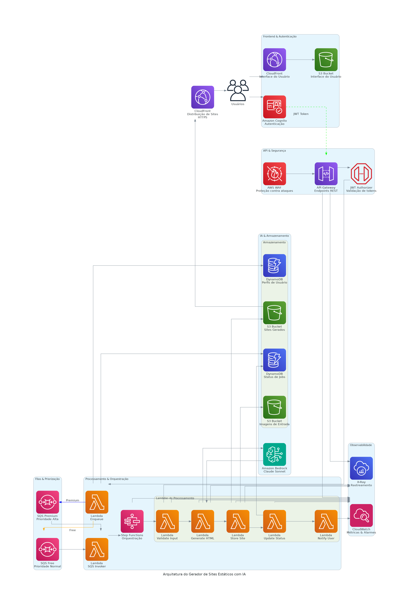

# Gerador de Sites com IA - Arquitetura Serverless AWS

## 🌐 Visão Geral

### Objetivo do Projeto
📌 POC – Implementação de MCP Server para Suporte Arquitetural e Boas Práticas em Terraform/AWS

Descrição:
Este projeto consiste em uma Prova de Conceito (POC) para avaliar a integração de um MCP Server (Model Context Protocol Server) no suporte à visão arquitetural de sistemas em AWS, com foco em:

Aplicação de boas práticas de Infraestrutura como Código (IaC) utilizando Terraform;

Padronização e governança de recursos AWS (segurança, identidade, compute, storage e observabilidade);

Exploração de padrões arquiteturais modernos e guidelines do AWS Well-Architected Framework;

Criação de uma infraestrutura de referência, construída exclusivamente para fins de estudo, testes e validação de conceitos.

Objetivo Técnico:

Demonstrar como o uso de MCP Servers pode ampliar a automação e a contextualização de arquiteturas na AWS.

Avaliar a viabilidade de adotar fluxos de IaC com melhor rastreabilidade, modularidade e segurança.

Fornecer uma base para estudos avançados em arquitetura de sistemas distribuídos, orquestração de infraestrutura e governança multi-conta em ambientes corporativos.

## 🏗️ Arquitetura de Solução

### Diagrama Arquitetural Completo


### Descrição Arquitetural
Esta solução implementa uma arquitetura serverless altamente modular e escalável, utilizando os serviços mais avançados da AWS para criar uma plataforma de geração de sites com IA. O diagrama acima ilustra a complexidade e a elegância da nossa infraestrutura, que combina múltiplos serviços AWS para criar uma experiência de geração de sites única e eficiente.

## 🔑 Componentes Principais

### Serviços Estratégicos
| Categoria | Serviços | Função Principal | Benefícios |
|-----------|----------|-----------------|------------|
| Computação | AWS Lambda, Step Functions | Processamento serverless | Escalabilidade automática, custo por uso |
| IA | Amazon Bedrock | Geração de conteúdo | Modelos de IA de última geração |
| Rede | CloudFront, API Gateway | Distribuição e API | Baixa latência, segurança de borda |
| Armazenamento | S3, DynamoDB | Persistência de dados | Durabilidade, performance |
| Segurança | IAM, Cognito, KMS | Controle de acesso | Proteção multicamada |

## 🚀 Automação e Provisionamento

### Comando `make all`: Infraestrutura como Código Simplificada

O comando `make all` é a principal ferramenta de automação para provisionamento de infraestrutura neste projeto. Ele executa uma sequência de tarefas críticas de forma eficiente e padronizada:

1. **Aplicação do Terraform**: 
   - Provisiona todos os recursos AWS definidos nos arquivos de configuração
   - Aplica automaticamente as mudanças de infraestrutura com `-auto-approve`

2. **Atualização de Recursos Dinâmicos**:
   - Executa o script `update_form_html.sh` para atualizar recursos específicos
   - Garante que a infraestrutura esteja sempre sincronizada com as últimas configurações

3. **Upload para S3**:
   - Faz upload do arquivo `form.html` para o bucket S3 criado
   - Automatiza a distribuição de conteúdo estático

#### Scripts de Automação Incluídos

- `update_form_html.sh`: Atualiza dinamicamente recursos HTML
- Scripts de gerenciamento de estado Terraform:
  - `limpar-estado`: Limpa arquivos de estado local
  - `iniciar-estado`: Inicializa o estado do Terraform para ambientes dev e prod
  - `capturar-estado`: Captura o estado atual da infraestrutura
  - `planejar-estado`: Planeja mudanças nos ambientes

## 🔄 Evolução para GitOps

### Próximos Passos para Implementação GitOps

1. **Configuração do Repositório**:
   - Adicionar workflows do GitHub Actions
   - Configurar triggers para provisionamento automático

2. **Exemplo de Workflow GitOps**:
```yaml
name: Infrastructure Deployment

on:
  push:
    branches:
      - main

jobs:
  deploy:
    runs-on: ubuntu-latest
    steps:
      - uses: actions/checkout@v2
      - name: Set up Terraform
        uses: hashicorp/setup-terraform@v1
      
      - name: Terraform Init
        run: make iniciar-estado
      
      - name: Terraform Plan
        run: make planejar-estado
      
      - name: Terraform Apply
        run: make all
```

3. **Benefícios da Abordagem GitOps**:
   - Rastreabilidade completa de mudanças
   - Revisão e aprovação de alterações via Pull Requests
   - Consistência entre ambientes
   - Rollback simplificado

## 🔍 Documentação Detalhada

Para uma análise completa da arquitetura, consulte nossa [documentação técnica detalhada](ARCHITECTURE.md).


## Como implantar

1. Configure suas credenciais AWS (perfil padrão) e defina a região via `AWS_REGION` ou `provider.tf`.
2. No diretório raiz, execute:
   ```bash
   terraform init
   terraform validate
   terraform plan -out tf.plan

3. Crie a infra utilziando o make - Atualizar o form html com os dados do Cognito
  make all   
   ```
4. Saídas úteis:
   - URL da API (REST): `module.api_gateway.invoke_url`
   - Distribuição CloudFront: consulte as saídas do módulo `cloudfront`.

