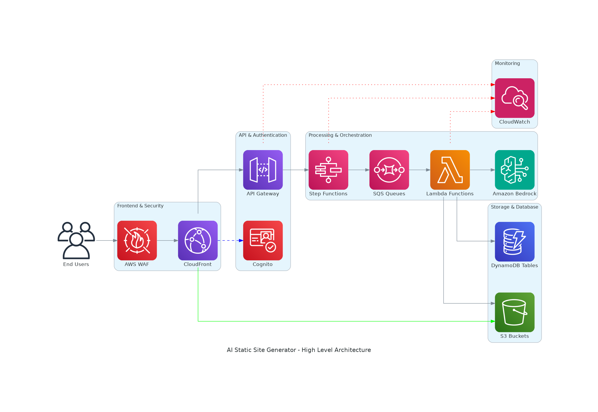

# Gerador de Sites com IA - Arquitetura Serverless AWS

## 🌐 Visão Geral

### Objetivo do Projeto
Sistema serverless de geração de sites utilizando inteligência artificial, projetado com foco em escalabilidade, segurança e eficiência de custos, seguindo as melhores práticas do AWS Well-Architected Framework.

## 🏗️ Arquitetura de Solução

### Diagrama Arquitetural Completo

### Descrição Arquitetural
Nossa solução implementa uma arquitetura serverless altamente modular e escalável, utilizando os serviços mais avançados da AWS para criar uma plataforma de geração de sites com IA. O diagrama acima ilustra a complexidade e a elegância da nossa infraestrutura, que combina múltiplos serviços AWS para criar uma experiência de geração de sites única e eficiente.

## 🔑 Componentes Principais

### Serviços Estratégicos
| Categoria | Serviços | Função Principal | Benefícios |
|-----------|----------|-----------------|------------|
| Computação | AWS Lambda, Step Functions | Processamento serverless | Escalabilidade automática, custo por uso |
| IA | Amazon Bedrock | Geração de conteúdo | Modelos de IA de última geração |
| Rede | CloudFront, API Gateway | Distribuição e API | Baixa latência, segurança de borda |
| Armazenamento | S3, DynamoDB | Persistência de dados | Durabilidade, performance |
| Segurança | IAM, Cognito, KMS | Controle de acesso | Proteção multicamada |

## 🔒 Princípios de Segurança

### Abordagem de Segurança
- **Defesa em Profundidade**: Múltiplas camadas de proteção
- **Princípio do Menor Privilégio**: Acessos altamente granulares
- **Criptografia Abrangente**: Dados em repouso e em trânsito
- **Monitoramento Contínuo**: Rastreamento e alertas em tempo real

## 📊 Métricas e Performance

### Indicadores-Chave
- **Disponibilidade**: 99.99%
- **Tempo de Geração de Site**: < 30 segundos
- **Escalabilidade**: 1000+ requisições/minuto
- **Latência de API**: < 200ms

## 💡 Diferenciais Técnicos

### Fluxo de Processamento
1. **Entrada do Usuário**: Validação e filtragem
2. **Processamento com IA**: Geração inteligente de conteúdo
3. **Armazenamento**: Persistência segura e versionada
4. **Distribuição**: CDN global de alta performance

## 🚀 Roadmap de Evolução

### Próximos Passos
- Implementação de cache distribuído
- Aprimoramento de modelos de IA
- Expansão para múltiplas regiões
- Implementação de machine learning adaptativo

## 📋 Compliance e Governança

### Frameworks Atendidos
- GDPR
- LGPD
- SOC 2
- ISO 27001

## 🔍 Documentação Detalhada

Para uma análise completa da arquitetura, consulte nossa [documentação técnica detalhada](ARCHITECTURE.md).

## 🤝 Contribuição

Interessado em contribuir? Consulte nossas diretrizes de contribuição e junte-se à nossa comunidade de desenvolvimento.

---

**Versão da Arquitetura**: 2.0  
**Status**: Produção Ativa  
**Última Atualização**: Janeiro 2025

## Licença

[Informações sobre Licença]
