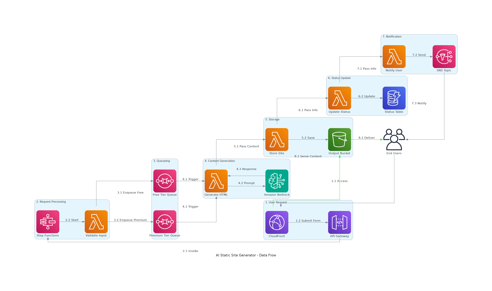
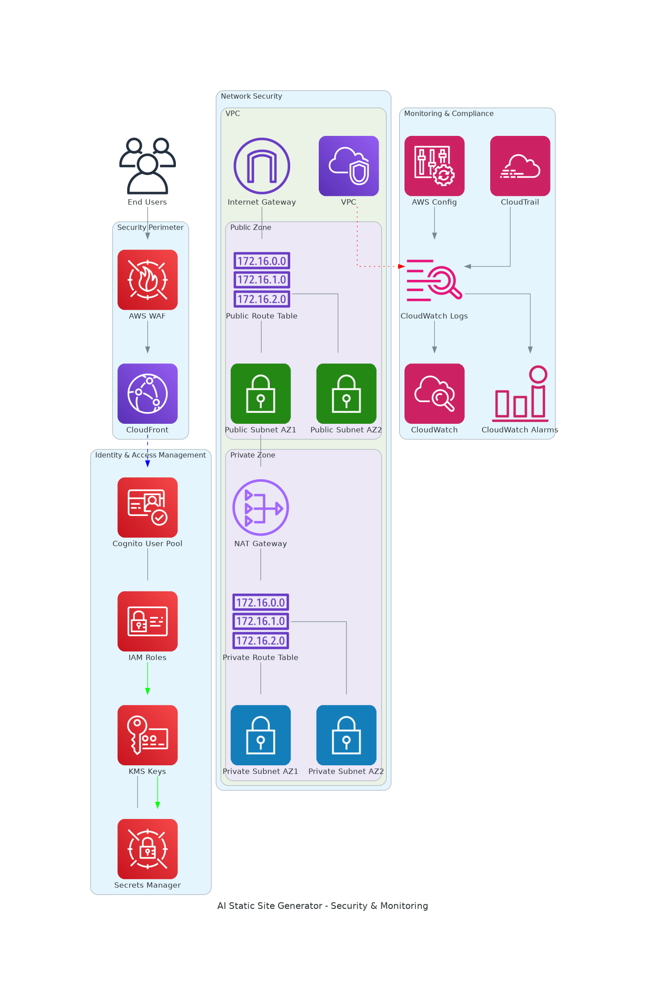

# Gerador de Sites com IA - Infraestrutura Terraform

## Diagramas de Arquitetura

### Visão Geral da Arquitetura

Este diagrama apresenta a arquitetura de alto nível do projeto, mostrando os principais componentes e fluxos de interação entre os serviços AWS.

### Fluxo de Dados

O diagrama de fluxo de dados ilustra como as informações são processadas e movimentadas através dos diferentes serviços e componentes da infraestrutura.

### Segurança e Monitoramento

Este diagrama detalha os aspectos de segurança e observabilidade do sistema, destacando como os diferentes serviços de segurança e monitoramento estão integrados.

## Visão Geral

Este projeto implementa uma infraestrutura robusta e escalável para um gerador de sites com IA, utilizando os serviços da AWS e seguindo as melhores práticas de infraestrutura como código com Terraform.

[Restante do conteúdo original do README...]
