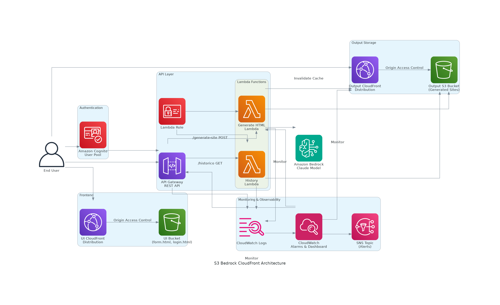

# Terraform S3 + Bedrock + CloudFront + API Gateway

Este projeto Terraform provisiona uma arquitetura AWS para hospedar sites estáticos em um bucket S3, onde o conteúdo HTML é gerado automaticamente via Amazon Bedrock através de uma API Gateway e servido através de uma distribuição do CloudFront.

## Arquitetura



Para uma documentação detalhada de todos os recursos da infraestrutura, consulte o [Mapeamento de Recursos](./resource-mapping.md).

A arquitetura implementada consiste em:

1. **API Gateway**:
   - Endpoint REST com método POST
   - Autenticação via API Key (opcional)
   - Recebe o tema do site a ser gerado
   - Integração com Lambda

2. **AWS Lambda**:
   - Recebe requisições da API Gateway
   - Invoca o Amazon Bedrock com o tema solicitado
   - Salva o HTML gerado no bucket S3
   - Invalida o cache do CloudFront após upload

3. **Amazon Bedrock**:
   - Utiliza um modelo da família Anthropic (Claude)
   - Gera HTML com base no tema fornecido
   - Personalização via template de prompt

4. **Amazon S3**:
   - Bucket configurado para hospedagem de site estático
   - Bloqueio de acesso público ativado
   - Versionamento habilitado
   - Armazena o arquivo `index.html` gerado pelo Bedrock

5. **Amazon CloudFront**:
   - Distribuição na frente do S3
   - OAC (Origin Access Control) configurado
   - Redirecionamento de HTTP para HTTPS
   - TTLs ajustados conforme melhores práticas
   - Cache invalidado automaticamente após atualizações

6. **IAM**:
   - Permissões para Lambda acessar Bedrock, S3 e CloudFront
   - Seguindo o princípio do privilégio mínimo

## Fluxo de Funcionamento

1. O usuário envia uma requisição POST para a API Gateway com o tema do site
2. A API Gateway encaminha a requisição para a função Lambda
3. O Lambda invoca o Amazon Bedrock com o prompt formatado
4. O Bedrock gera o HTML com base no tema fornecido
5. O Lambda salva o HTML no bucket S3
6. O Lambda invalida o cache do CloudFront
7. O usuário recebe a URL do site gerado
8. O site é servido através do CloudFront

## Pré-requisitos

- Terraform >= 1.3.0
- AWS CLI configurado com credenciais apropriadas
- Acesso ao serviço Amazon Bedrock na região escolhida
- Modelo Claude disponível na sua conta AWS

## Uso

### 1. Inicializar o Terraform

```bash
terraform init
```

### 2. Revisar o plano de execução

```bash
terraform plan -var="bucket_name=meu-site-estatico-unico"
```

### 3. Aplicar a configuração

```bash
terraform apply -var="bucket_name=meu-site-estatico-unico"
```

### 4. Testar a API

Após a conclusão do `terraform apply`, você receberá o endpoint da API e um exemplo de comando curl para testá-la:

```bash
curl -X POST https://abcdef123.execute-api.us-east-1.amazonaws.com/prod/generate-site \
  -H 'Content-Type: application/json' \
  -H 'x-api-key: YOUR_API_KEY' \
  -d '{"site_theme": "exemplo de tema"}'
```

A resposta incluirá a URL do CloudFront onde o site gerado pode ser acessado.

## Variáveis

| Nome | Descrição | Tipo | Default | Obrigatório |
|------|-----------|------|---------|-------------|
| `region` | Região AWS onde os recursos serão criados | `string` | `"us-east-1"` | Não |
| `bucket_name` | Nome único para o bucket S3 | `string` | - | Sim |
| `tags` | Tags padrão a serem aplicadas aos recursos | `map(string)` | `{ Environment = "dev", ... }` | Não |
| `enable_versioning` | Habilita o versionamento de objetos no bucket | `bool` | `true` | Não |
| `cloudfront_price_class` | Classe de preço do CloudFront | `string` | `"PriceClass_100"` | Não |
| `cloudfront_default_ttl` | TTL padrão para o cache do CloudFront (em segundos) | `number` | `86400` | Não |
| `cloudfront_min_ttl` | TTL mínimo para o cache do CloudFront (em segundos) | `number` | `0` | Não |
| `cloudfront_max_ttl` | TTL máximo para o cache do CloudFront (em segundos) | `number` | `31536000` | Não |
| `enable_cloudfront_logs` | Habilita logs de acesso para a distribuição CloudFront | `bool` | `false` | Não |
| `cloudfront_log_bucket` | Nome do bucket para armazenar logs do CloudFront | `string` | `null` | Não |
| `cloudfront_log_prefix` | Prefixo para os logs do CloudFront | `string` | `"cloudfront-logs/"` | Não |
| `bedrock_model_id` | ID do modelo Bedrock a ser utilizado | `string` | `"anthropic.claude-3-sonnet-20240229-v1:0"` | Não |
| `html_prompt_template` | Template de prompt para geração do HTML via Bedrock | `string` | `"Crie um HTML para um site sobre [TEMA]..."` | Não |
| `api_name` | Nome da API Gateway | `string` | `"site-generator-api"` | Não |
| `api_stage_name` | Nome do estágio da API Gateway | `string` | `"prod"` | Não |
| `api_key_required` | Define se a API requer uma chave de API para acesso | `bool` | `true` | Não |
| `enable_api_logs` | Habilita logs para a API Gateway no CloudWatch | `bool` | `false` | Não |
| `lambda_runtime` | Runtime da função Lambda | `string` | `"python3.9"` | Não |
| `lambda_timeout` | Timeout da função Lambda em segundos | `number` | `60` | Não |
| `lambda_memory_size` | Memória alocada para a função Lambda em MB | `number` | `256` | Não |
| `enable_multi_site` | Habilita suporte para múltiplos sites com pastas por cliente | `bool` | `false` | Não |

## Outputs

| Nome | Descrição |
|------|-----------|
| `bucket_name` | Nome do bucket S3 criado |
| `bucket_arn` | ARN do bucket S3 criado |
| `bucket_website_endpoint` | Endpoint de website do bucket S3 (não acessível diretamente) |
| `cloudfront_domain_name` | Nome de domínio da distribuição CloudFront |
| `cloudfront_distribution_id` | ID da distribuição CloudFront |
| `cloudfront_url` | URL completa da distribuição CloudFront |
| `api_endpoint` | URL do endpoint da API para geração de sites |
| `api_key` | Chave de API para acesso à API (somente se api_key_required = true) |
| `lambda_function_name` | Nome da função Lambda que gera o HTML |
| `bedrock_model_used` | Modelo do Bedrock utilizado para gerar o HTML |
| `curl_example` | Exemplo de comando curl para testar a API |

## Considerações de Segurança

- O bucket S3 está configurado com bloqueio de acesso público
- O acesso ao bucket é permitido apenas via CloudFront usando OAC
- As permissões IAM seguem o princípio do privilégio mínimo
- A distribuição CloudFront força HTTPS
- A API pode ser protegida com API Key
- Logs habilitados para API Gateway e Lambda

## Recursos Adicionais

- **Suporte para múltiplos sites**: Quando habilitado, cada requisição cria um site em uma pasta separada
- **Invalidação automática de cache**: O CloudFront é invalidado após cada atualização
- **Logs detalhados**: Logs para API Gateway e Lambda no CloudWatch
- **Personalização de prompt**: Template de prompt configurável para diferentes estilos de site

## Compatibilidade com AWS Control Tower

Este projeto foi desenvolvido considerando as melhores práticas de segurança e é compatível com ambientes AWS Control Tower. As tags de controle (`Environment`, `Team`, `Project`, `Owner`) são aplicadas a todos os recursos para facilitar a governança.

## Troubleshooting

### Erro: Plugin did not respond

Se você encontrar o erro:
```
Error: Plugin did not respond
│ 
│   with provider["registry.terraform.io/hashicorp/aws"],
│   on provider.tf line 30, in provider "aws":
│   30: provider "aws" {
│ 
│ The plugin encountered an error, and failed to respond to the plugin.(*GRPCProvider).ValidateProviderConfig call. The plugin
│ logs may contain more details.
```

**Solução**:
1. **Reinicialize o Terraform com upgrade**:
   ```bash
   terraform init -upgrade
   ```

2. **Limpe o cache de plugins do Terraform**:
   ```bash
   rm -rf ~/.terraform.d/plugin-cache
   # ou no Windows
   # rmdir /s /q %APPDATA%\terraform.d\plugin-cache
   ```

3. **Especifique uma versão exata do provider AWS**:
   Edite o arquivo `provider.tf` para usar uma versão específica em vez de um range:
   ```hcl
   required_providers {
     aws = {
       source  = "hashicorp/aws"
       version = "4.67.0"  # Use uma versão específica em vez de ">= 4.0.0"
     }
   }
   ```

4. **Verifique a compatibilidade entre o Terraform e o provider AWS**:
   Certifique-se de que a versão do Terraform que você está usando é compatível com a versão do provider AWS.

### Erro: CloudWatch Logs role ARN must be set in account settings to enable logging

Se você encontrar o erro:
```
Error: updating API Gateway Stage (ags-orzhrwapyl-prod): operation error API Gateway: UpdateStage, https response error StatusCode: 400, RequestID: 07e291e0-e5a7-424c-a67d-bcee73451cba, BadRequestException: CloudWatch Logs role ARN must be set in account settings to enable logging
```

**Solução**:
1. **Opção 1 (Recomendada)**: Desabilite os logs da API Gateway definindo a variável `enable_api_logs` como `false`:
   ```bash
   terraform apply -var="bucket_name=meu-site-estatico-unico" -var="enable_api_logs=false"
   ```

2. **Opção 2**: Configure o CloudWatch Logs role ARN nas configurações da sua conta AWS:
   - Acesse o console da AWS > API Gateway > Configurações
   - Configure o CloudWatch Logs role ARN
   - Veja a [documentação oficial](https://docs.aws.amazon.com/apigateway/latest/developerguide/set-up-logging.html) para mais detalhes

### Erro: The specified log group already exists

Se você encontrar o erro:
```
Error: creating CloudWatch Logs Log Group (/aws/lambda/bedrock-generate-html): operation error CloudWatch Logs: CreateLogGroup, https response error StatusCode: 400, RequestID: 1eafcb74-422a-4582-a947-2f212e978ace, ResourceAlreadyExistsException: The specified log group already exists
```

**Solução**:
1. **Opção 1 (Implementada neste projeto)**: Use um data source para referenciar o grupo de logs existente em vez de tentar criá-lo:
   ```hcl
   # Comentando o recurso de grupo de logs para Lambda, pois ele já existe
   # resource "aws_cloudwatch_log_group" "lambda_logs" {
   #   name              = "/aws/lambda/${aws_lambda_function.generate_html.function_name}"
   #   retention_in_days = 7
   #   tags              = var.tags
   # }

   # Em vez disso, usamos um data source para referenciar o grupo de logs existente
   data "aws_cloudwatch_log_group" "lambda_logs" {
     name = "/aws/lambda/${aws_lambda_function.generate_html.function_name}"
     depends_on = [aws_lambda_function.generate_html]
   }
   ```

2. **Opção 2**: Importe o grupo de logs existente para o estado do Terraform:
   ```bash
   terraform import aws_cloudwatch_log_group.lambda_logs /aws/lambda/bedrock-generate-html
   ```

3. **Opção 3**: Remova o grupo de logs existente manualmente (cuidado, isso excluirá os logs):
   ```bash
   aws logs delete-log-group --log-group-name /aws/lambda/bedrock-generate-html
   ```

## Licença

Este projeto está licenciado sob a licença MIT.
